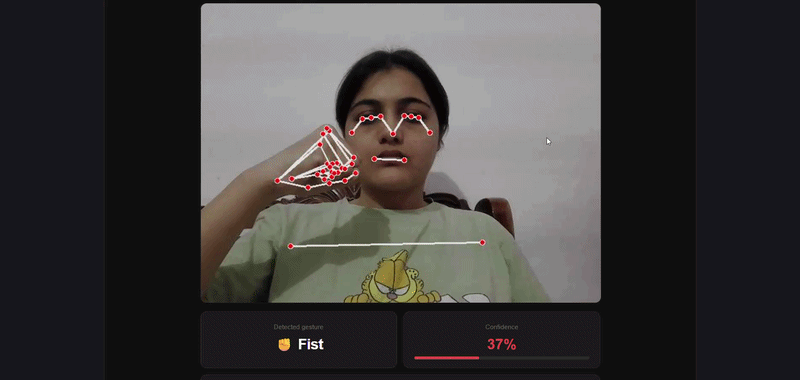

# Real-Time Pose & Gesture Classifier

A real-time hand gesture recognition system using MediaPipe, Random Forest, and a PyTorch MLP — deployed via FastAPI backend and React frontend.

## Demo

> Run locally and point your webcam at your hand. Gestures are classified in under 80ms.



---

## Results

| Model | Accuracy |
|---|---|
| Random Forest (200 estimators) | 98% |
| PyTorch MLP (3-layer) | 69% val_acc |

Gaussian noise augmentation (`σ=0.02`) applied to training landmarks to improve generalisation across lighting conditions and hand angles.

---

## Supported Gestures

| Gesture | Label |
|---|---|
| 👍 | thumbs_up |
| 👎 | thumbs_down |
| 🖐 | open_palm |
| ✊ | fist |
| ☝️ | point |

---

## Architecture

```
Webcam → OpenCV → MediaPipe Holistic → 258 landmark features
       → Random Forest Classifier → FastAPI WebSocket
       → React Frontend (live feed + gesture label)
```

**Feature vector:** 33 pose landmarks (x, y, z, visibility) + 21 left hand landmarks (x, y, z) + 21 right hand landmarks (x, y, z) = **258 features**

---

## Tech Stack

- **Computer Vision:** OpenCV, MediaPipe Holistic
- **ML:** Scikit-learn (Random Forest), PyTorch (MLP)
- **Backend:** FastAPI, Uvicorn, WebSocket
- **Frontend:** React, Vite
- **Containerisation:** Docker

---

## Project Structure

```
pose-gesture-classifier/
├── backend/
│   ├── collect_data.py      # Webcam data collection
│   ├── train_model.py       # Model training + evaluation
│   ├── main.py              # FastAPI WebSocket server
│   └── model/
│       ├── gesture_model.pkl    # Trained Random Forest
│       ├── gesture_net.pt       # Trained PyTorch MLP
│       └── confusion_matrix.png
├── frontend/
│   └── src/
│       └── App.jsx          # React UI
└── README.md
```

---

## Run Locally

### Backend
```bash
cd backend
python -m venv venv
venv\Scripts\activate        # Windows
pip install -r requirements.txt
uvicorn main:app --reload
```

### Frontend
```bash
cd frontend
npm install
npm run dev
```

Open `http://localhost:5173`

---

## Data Collection & Training

```bash
# Collect gesture data (200-300 samples per class)
python collect_data.py

# Train models
python train_model.py
```

---

## Key ML Decisions

- **MediaPipe Holistic** chosen over hand-only model to capture full body context
- **Random Forest** preferred over MLP for inference due to faster prediction and better accuracy on tabular landmark data
- **Gaussian noise augmentation** added to training set to prevent overfitting to specific lighting/hand positions
- **Temporal smoothing** (5-frame mode filter) applied on frontend to stabilise predictions during hand transitions

---

## Author

**Divyanshi Vats**
- LinkedIn: [Divyanshi-vats03](https://linkedin.com/in/Divyanshi-vats03)
- GitHub: [DivyanshiVats13](https://github.com/DivyanshiVats13)